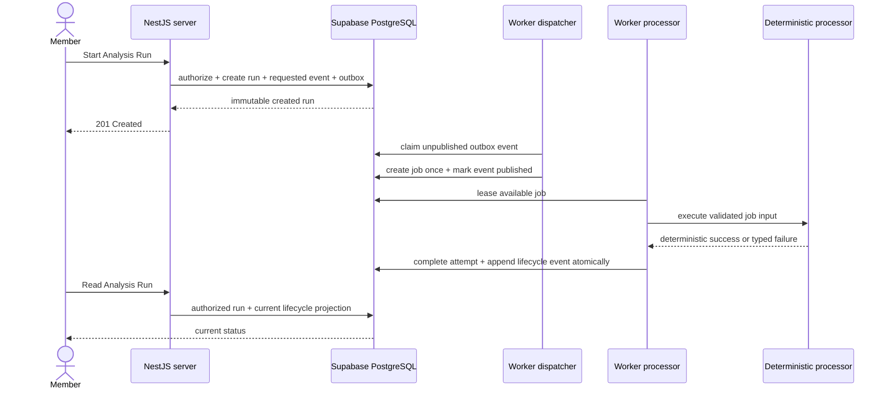
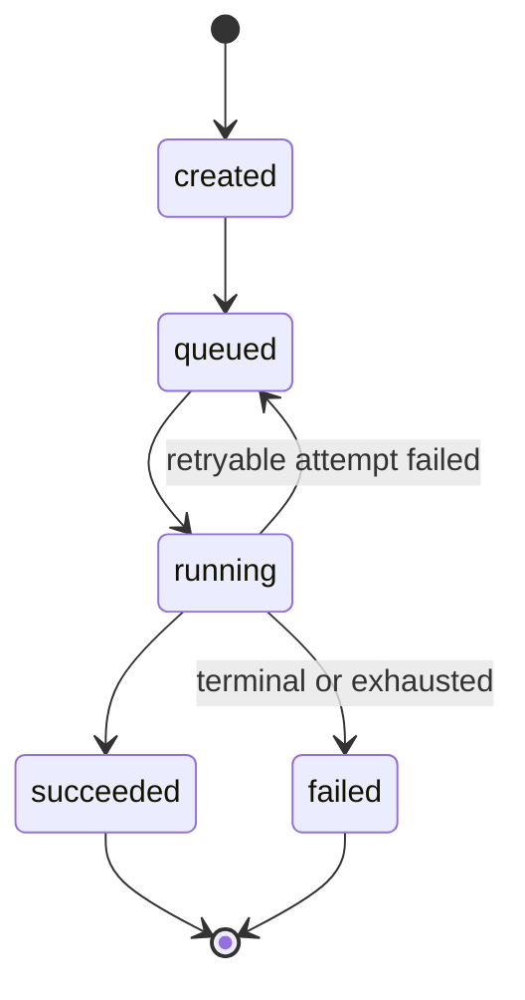

# Analysis Run Processing Contracts

> **Document ID:** OMO-ARC-004
> **Version:** 1.1
> **Status:** Approved Phase 4 foundation and Phase 5 scope extension
> **Date:** 7 September 2026
> **Product:** Omoikane - The Collaborative Intelligence Platform

## 1. Purpose and scope

This document defines the minimum contracts needed to evolve the implemented
Analysis Run acceptance record into durable asynchronous processing. It makes
the next Phase 4 slices independently testable without scaffolding a generic
workflow platform or designing AI product features ahead of use.

The completed processing foundation now proves this flow:

```text
authenticated member request with selected channel and UTC time range
  -> atomic workspace membership and active-channel authorization
  -> immutable analysis_runs row and append-only lifecycle
  -> durable dispatch and lease-fenced worker execution
  -> authorized current-status projection
```

The run row remains the immutable record that the trusted server accepted a
user request, including its selected channel and inclusive-start,
exclusive-end source interval. Historical runs retain null for scope added
after their acceptance rather than receiving fabricated values. Lifecycle facts, the
outbox, durable jobs, and the worker surround
it; they do not turn that row into a mutable job record.

The first result extension defines deterministic inventory findings and exact
message-revision source references. Source loading reauthorizes and limits
that inventory to messages created in the run's active channel and immutable
time range. It does not yet define prompts, hosted model
providers, retrieval, embeddings, human review, Server-Sent Events, Redis, or a
general-purpose workflow engine. Those enter only with a consuming vertical
slice.

## 2. Governing decisions

This design implements the existing decision baseline rather than creating new
direction:

- D-003 keeps the trusted server a modular monolith.
- D-007 assigns asynchronous execution to a separate AI worker runtime.
- D-008 keeps PostgreSQL as the system of record.
- D-009 requires a transactional outbox and PostgreSQL-backed jobs before an
  external broker.
- D-010 makes each Analysis Run immutable and keeps AI findings proposed until
  human review.
- D-013 requires conservative, independently verified vertical slices.

No ADR is needed for this document because it does not replace an approved
decision. A later change to the database queue, immutable-run rule, or worker
boundary requires an ADR.

## 3. Terms and ownership

| Term            | Meaning and owner                                                                                                |
| --------------- | ---------------------------------------------------------------------------------------------------------------- |
| Analysis Run    | Immutable acceptance identity and request scope owned by the analysis domain.                                    |
| Lifecycle event | Append-only fact that an Analysis Run reached a valid processing state.                                          |
| Outbox event    | Durable intent, committed with the business change, that another process must dispatch.                          |
| Analysis job    | PostgreSQL queue record containing execution mechanics for one supported analysis operation.                     |
| Job attempt     | Append-only audit record for one lease-owned execution attempt.                                                  |
| Processor       | Application capability that performs one job without knowing PostgreSQL leasing or process lifecycle.            |
| Dispatcher      | Infrastructure workflow that converts an unpublished Analysis Run outbox event into one durable job.             |
| Worker runtime  | Node.js process that dispatches outbox events, leases jobs, invokes processors, and records their outcomes.      |
| Current status  | Read projection derived from the latest valid lifecycle event; it is not mutable state on the immutable run row. |

The domain owns legal lifecycle states and transitions. Application code owns
the dispatch and execution workflows. PostgreSQL adapters own claims, leases,
transactions, and row mapping. `apps/ai-worker` owns polling, concurrency,
signals, health, and final Effect execution.

## 4. Runtime flow



The outbox dispatcher and job processor initially run as two cohesive loops in
one `apps/ai-worker` process. They remain separate application workflows so a
measured deployment need can separate them later without changing business
contracts.

## 5. Analysis Run lifecycle

### 5.1 States

The supported processing states are:

| State       | Meaning                                                                                 |
| ----------- | --------------------------------------------------------------------------------------- |
| `created`   | The request, initial lifecycle fact, and outbox intent committed atomically.            |
| `queued`    | The requested outbox event produced one durable job.                                    |
| `running`   | A worker holds the current valid lease and began an attempt.                            |
| `succeeded` | The processor result and successful attempt committed exactly once.                     |
| `failed`    | A non-retryable failure or exhausted retry policy committed a terminal failure outcome. |

Cancellation is not part of the first Phase 4 lifecycle. Adding it requires a
product rule for queued and in-flight work rather than another string literal.

### 5.2 Legal transitions



Rules:

- The database command that appends a lifecycle event validates the previous
  state and rejects every transition not shown above.
- `created`, `succeeded`, and `failed` occur at most once per Analysis Run.
- A retry appends a new `queued` event; it never rewrites or removes the failed
  attempt.
- Terminal states cannot transition in this contract. Manual replay creates a
  new Analysis Run until a separately designed retry product capability exists.
- Event ordering uses a per-run monotonic sequence assigned by PostgreSQL, not
  wall-clock comparison.
- Timestamps are operational metadata. Sequence and identity establish order
  and uniqueness.

The initial `analysis_runs.status = 'created'` column remains unchanged during
the first Phase 4 increments for backward compatibility. Once the read path
consumes lifecycle events, it continues to mean acceptance state and must not
be updated to mirror execution state. A later migration may rename or remove
that redundant column only as a dedicated compatibility change.

## 6. Persistence contracts

The names below are implementation targets, not shared TypeScript contracts.
Generated database types remain inside infrastructure.

### 6.1 Immutable acceptance

`analysis_runs` continues to own:

- `analysis_run_id`;
- `workspace_id`;
- `channel_id` for all post-scope runs (historical rows remain null);
- inclusive `time_range_start` and exclusive `time_range_end` for all
  post-range runs (historical rows remain null);
- `requested_by`;
- acceptance status during compatibility;
- `created_at`.

New intervals must be positive, at most 31 days long, and cannot end in the
future when accepted. The existing update/delete rejection stays in force, so
later processing cannot widen or shift the accepted evidence boundary.

### 6.2 Lifecycle event ledger

`analysis_run_lifecycle_events` is append-only and contains at minimum:

- event identity;
- Analysis Run identity;
- per-run sequence;
- one supported lifecycle state;
- optional safe failure category for terminal failure;
- job and attempt identities when applicable;
- occurrence timestamp.

Required constraints include unique `(analysis_run_id, sequence)`, one initial
event, and one event for each terminal state. Payloads, prompts, model output,
stack traces, and raw provider errors do not belong in this ledger.

The current-state read projection selects the greatest sequence for a run. It
may begin as a view or focused query; a materialized status table is not added
without measured read pressure.

### 6.3 Capability-specific outbox

`analysis_run_outbox_events` contains only Analysis Run integration intents.
Its first event catalogue has one entry:

| Event name               | Producer                   | Consumer                   | Meaning                                    |
| ------------------------ | -------------------------- | -------------------------- | ------------------------------------------ |
| `analysis_run.requested` | Start Analysis Run command | Analysis outbox dispatcher | Create one `analysis.execute` durable job. |

An event stores its identity, Analysis Run and workspace identities, event
name/version, W3C `traceparent` and optional `tracestate`, creation time,
availability time, claim metadata, attempt count, publication time, and a safe
last-error category and dead-letter time. It does not copy workspace content,
access tokens, prompts, or user-generated message text.

Trace context is runtime correlation metadata, not an Analysis Run domain
invariant. The server telemetry boundary supplies a normalized carrier to the
start workflow; the application command transports that opaque carrier, and
the Supabase adapter persists it. This focused type remains in the analysis
application library unless a second capability proves a shared platform
contract is useful.

The start command commits the Analysis Run, initial `created` lifecycle event,
and `analysis_run.requested` outbox event in one PostgreSQL transaction. A
response is successful only after all three are durable.

Publication means the durable job exists, not that the job finished. The
dispatcher transaction creates or finds the idempotent job, appends `queued`
when newly created, and marks the outbox event published. A crash cannot leave
an event marked published without its job.

Outbox acquisition also uses a bounded lease token and `FOR UPDATE SKIP LOCKED`.
Only the current claimant may publish or reschedule the event. Dispatch uses the
same five-attempt backoff policy defined below. Exhausting it dead-letters the
outbox event and appends the Analysis Run `failed` lifecycle event atomically;
it never leaves a run indefinitely presented as healthy `created` work.

### 6.4 PostgreSQL job queue

`analysis_jobs` is deliberately capability-specific. Its first job catalogue
is:

| Job kind           | Input identity  | Processor contract                           |
| ------------------ | --------------- | -------------------------------------------- |
| `analysis.execute` | Analysis Run ID | Execute the deterministic Phase 4 processor. |

The queue stores job identity and kind, Analysis Run identity, availability,
attempt count, maximum attempts, lease owner/token/expiry, terminal outcome,
safe failure category, and timestamps. The worker loads authoritative run
scope after leasing; the queue does not embed a mutable domain aggregate.

Acquisition is an atomic PostgreSQL command using row locks with
`FOR UPDATE SKIP LOCKED`. It returns only available, non-terminal jobs whose
lease is absent or expired. Acquisition increments the attempt number, assigns
an opaque lease token, sets a bounded expiry, and appends the corresponding
attempt and `running` facts in the same transaction.

Only a command presenting the current lease token may heartbeat, succeed, or
fail that attempt. Completion after lease expiry or replacement is rejected as
stale. This fencing rule prevents an interrupted worker from overwriting a
newer attempt.

### 6.5 Attempt audit

`analysis_job_attempts` records attempt identity, job identity, attempt number,
lease owner, start/end timestamps, processor version, outcome, optional
deterministic result fingerprint, safe failure category, and duration. An
active attempt may be completed only by its lease-fenced database command and
is immutable after completion. Detailed diagnostic causes remain in protected
telemetry rather than database-facing failure fields.

## 7. Idempotency and delivery semantics

The platform guarantees at-least-once delivery with idempotent effects; it does
not claim exactly-once process execution.

The following database uniqueness rules turn redelivery into the same durable
result:

- one `analysis_run.requested` event per Analysis Run and event version;
- one `analysis.execute` job per Analysis Run and job version;
- one attempt per job and attempt number;
- one terminal lifecycle event per Analysis Run;
- one processor result per Analysis Run and processor version.

Dispatcher and worker commands return the already-committed outcome when the
same idempotency identity is replayed. They do not treat a unique-constraint
error as ordinary control flow in application code; the PostgreSQL command owns
the atomic insert-or-observe behavior.

HTTP request idempotency is a separate concern. The existing start endpoint
creates one run per accepted call. Before automatic client retry is enabled, a
dedicated slice must add a validated `Idempotency-Key`, persist its scope, and
return the original run for the same authenticated intent. Outbox/job
idempotency does not silently change that public contract.

## 8. Retry and dead-letter policy

Failures cross the processor boundary as one of:

- `retryable`: a temporary dependency or resource condition;
- `terminal`: invalid durable input, unsupported version, or permanent policy
  failure;
- defect: an unexpected fault recorded safely and treated as retryable until
  the attempt limit protects the system.

The initial policy is five total attempts. After retryable attempt `n`, the next
availability delay is `min(5 seconds * 2^(n - 1), 5 minutes)`, plus deterministic
jitter of up to 20 percent derived from job identity and attempt number. The
derivation makes tests reproducible while preventing synchronized retries.

A terminal failure, or a retryable failure on the fifth attempt, marks the job
dead-lettered and appends the Analysis Run `failed` event atomically. Dead-letter
is a queue outcome, not another Analysis Run status.

The first implementation exposes dead-letter records through database and
telemetry inspection. A user-facing retry or operator replay command is not
added until its authorization and new-run/reuse semantics are decided.

## 9. Worker application and runtime boundaries

The first worker project is `apps/ai-worker`, tagged as an application project
and Node.js worker runtime. It composes existing and new analysis Layers but does
not contain domain policy or Supabase queries.

```text
apps/ai-worker
  -> infrastructure/analysis
  -> application/analysis
  -> domain/analysis

infrastructure/analysis
  -> shared generated database contracts
```

The existing analysis libraries should be extended before creating another
analysis package. A new shared contracts library is justified only when server
and worker need the same serializable runtime contract and neither existing
analysis layer can own it without reversing dependencies.

Worker lifecycle:

1. Decode configuration before starting loops.
2. Build one managed Effect runtime and required Layers.
3. Prove database readiness before reporting ready.
4. Start bounded dispatcher and processor loops.
5. On termination, stop claiming new work first.
6. Interrupt polling waits and allow active attempts a bounded drain period.
7. Do not extend leases after the drain deadline; another worker may recover
   expired work.
8. Flush telemetry and dispose the runtime within a bounded timeout.

Liveness proves that the process loop can respond and never depends on
PostgreSQL or telemetry. Readiness proves configuration, runtime initialization,
and the ability to execute the queue's bounded database health command. An
optional telemetry backend is not a readiness dependency.

Concurrency starts at one job per worker process. Configuration may make that
small bound explicit, but adaptive concurrency and distributed rate limiting
wait for measurements. Redis is not required by the PostgreSQL queue.

## 10. Deterministic processor contract

The first processor proves durable execution without an LLM. It accepts a
validated Analysis Run execution context and returns a deterministic receipt
derived from canonical identities and a fixed processor version. It performs no
network access and does not read message content.

The receipt and workspace-message-inventory result are sufficient to prove that:

- the correct run was leased;
- a restart can recover the job;
- duplicate delivery cannot commit twice;
- success advances lifecycle state once;
- telemetry correlates the server request, outbox dispatch, and job attempt;
- bounded source selection records exact immutable message revision evidence
  created inside the accepted inclusive-start, exclusive-end interval;
- the result and proposed finding commit before the terminal success fact.

The processor port belongs in the analysis application library because the
worker consumes it. Hosted model adapters and human review remain Phase 5
capabilities governed by the
[Decision Forensics contracts](decision-forensics-contracts.md).

## 11. Security and data boundaries

- The browser cannot read or mutate outbox, job, attempt, or lifecycle tables
  directly.
- Public and authenticated roles receive no direct table privileges for worker
  internals.
- Server and worker call narrowly granted PostgreSQL commands; neither receives
  a generic database operation through application code.
- Every worker command re-establishes the Analysis Run, workspace, and selected
  active-channel scope from authoritative rows. Stored job data is not trusted
  as authorization input.
- Access revocation after acceptance does not delete or rewrite the audit
  record. Whether queued work may continue after revocation is checked by the
  processor policy introduced with the first content-reading analysis slice.
- Tokens, service-role credentials, message content, prompts, model output, and
  raw provider failures are excluded from queue payloads, lifecycle events, and
  ordinary logs.

## 12. Telemetry contract

The server stores the accepted request's W3C trace context on the outbox event.
The dispatcher continues that context for `analysis.outbox.dispatch`; the job
stores the context required for `analysis.job.execute`; each attempt creates its
own span. Retries preserve correlation but create distinct attempt spans.

Required safe correlation fields are service name/version, deployment
environment, trace/span IDs, Analysis Run ID, job ID, job kind, attempt number,
outcome, and bounded failure category. Workspace ID may appear in protected
traces and logs but never as a metric label. User IDs and all content are
excluded from metric labels.

Initial worker metrics cover outbox dispatch count/duration/failures, available
job count, lease acquisition count, attempt duration/outcome, retry scheduling,
dead-letter count, and oldest available-job age. Labels are limited to job kind,
operation, and bounded outcome/failure categories.

## 13. Verification ownership

| Owner          | Required proof                                                                                                |
| -------------- | ------------------------------------------------------------------------------------------------------------- |
| Domain         | Supported states and every legal/illegal transition.                                                          |
| Application    | Dispatch/execution orchestration, typed failure classification, stale lease handling, and processor contract. |
| Infrastructure | Atomic commands, mapping, duplicate replay, claim exclusion, fencing, retry availability, and error mapping.  |
| Database       | Constraints, privileges, transaction rollback, concurrent claims, expired lease recovery, and immutability.   |
| Worker runtime | Configuration, readiness/liveness, bounded loops, graceful shutdown, drain timeout, and telemetry flush.      |
| Integration    | Server request through outbox, job, worker restart, one terminal result, and one correlated trace.            |

Time-dependent application tests use an injected Effect clock or explicit
timestamps. Database tests use controlled timestamps through focused commands;
ordinary tests do not sleep for lease or backoff periods.

## 14. Conservative implementation order

Each item is one reviewable vertical slice:

1. **Atomic Analysis Run request event.** Add the append-only lifecycle ledger
   and capability-specific outbox. Change the existing start command to commit
   the run, `created` event, and `analysis_run.requested` event atomically. No
   worker or job table yet. **Completed:** the server supplies validated W3C
   correlation, the RPC commits all three records, internal tables deny direct
   browser/service-role access, and pgTAP proves rollback and immutability.
2. **Durable Analysis job dispatch.** Add the capability-specific job and
   attempt schema plus one idempotent dispatcher command that converts the
   requested event into a queued job. Exercise it through application and
   database tests before adding a process loop. **Completed:** PostgreSQL owns
   bounded outbox leases and fencing tokens; one atomic, replay-safe dispatch
   creates the versioned job, appends `queued`, publishes the source event, and
   preserves W3C trace context. Direct job/attempt access remains denied.
3. **Worker bootstrap and deterministic completion.** Add `apps/ai-worker`, one
   managed Effect runtime, health/lifecycle handling, bounded polling, and the
   deterministic processor. Prove restart recovery and terminal success.
   **Completed:** the worker dispatches and executes at concurrency one,
   exposes liveness/readiness, drains active work during shutdown, continues
   persisted W3C context, and uses lease-fenced commands to append `running`
   and exactly one `succeeded` fact. The processor reads no content.
4. **Retry and dead-letter behavior.** Add failure classification, leasing
   recovery, deterministic backoff, fencing, and terminal failure proof. Do not
   add a generic retry framework. **Completed:** typed processor failures and
   defects flow through one lease-fenced command; PostgreSQL records immutable
   attempts, schedules deterministic bounded retries, and atomically marks
   terminal or fifth-attempt failures as a dead-lettered job and failed run.
   Browser roles cannot invoke the command, and retry/dead-letter telemetry
   uses only bounded labels.
5. **Analysis Run status observation.** Extend the server/domain read contract
   and Angular state to display the lifecycle projection. Reconsider SSE only
   after polling real transitions is implemented and measured. **Completed:**
   the service-role-only read command derives current status from the latest
   ordered lifecycle event, the server exposes the validated projection, and
   feature-scoped Angular state polls active runs until success or failure while
   cancelling observation when its workspace/channel scope is replaced or
   destroyed.
6. **First result-bearing analysis.** Define source selection, immutable result
   records, findings, provider metadata, and evaluation fixtures in the product
   slice that consumes them. **Completed:** the deterministic workspace message
   inventory selects at most the 100 newest active immutable revisions from the
   run's selected channel, records
   exact evidence references and bounded processor metadata, and atomically
   commits one proposed finding with terminal success. Access is rechecked when
   the lease loads sources; evaluation fixtures cover empty, participant-count,
   truncation, and deterministic replay cases.

## 15. Phase 4 exit criteria

- An accepted Analysis Run atomically produces a durable processing intent.
- Dispatch redelivery produces one job.
- A job survives worker termination and lease expiry.
- Stale workers cannot commit after losing a lease.
- Retryable failures back off and terminal/exhausted failures dead-letter.
- A deterministic job commits one terminal Analysis Run outcome exactly once.
- A completed run exposes one immutable, evidence-linked result and proposed
  finding through its authorized read projection.
- Server, dispatcher, and attempt spans share end-to-end trace correlation.
- Database privileges keep queue internals inaccessible to browser roles.
- Existing direct Angular-to-Supabase collaboration paths remain unchanged.

## 16. References

- [Decision baseline](decision-baseline.md)
- [Modular server architecture](modular-server-architecture.md)
- [ADR 0001: NestJS and Effect runtime boundary](adr/0001-nestjs-effect-runtime-boundary.md)
- [ADR 0002: Supabase server authentication and workspace authorization](adr/0002-supabase-server-authentication-and-workspace-authorization.md)
- [Local development environment](../development/local-development-environment.md)
- [Deployment and environment strategy](../operations/deployment-and-environment-strategy.md)
- [Decision Forensics contracts](decision-forensics-contracts.md)
