# Product and Architecture Roadmap

> **Document ID:** OMO-RMP-001  
> **Version:** 1.0  
> **Status:** Approved baseline, repository-reconciled 9 August 2026
> **Date:** 2 August 2026  
> **Product:** Omoikane - The Collaborative Intelligence Platform

## 1. Roadmap rules

- This roadmap defines implementation order, not optional directions.
- Every phase delivers working software with explicit exit criteria.
- Each pull request has one primary architectural purpose and remains reviewable.
- Tests, migrations, observability, and documentation are part of a feature, not
  follow-up work.
- Introduce an abstraction only when a vertical slice requires it.
- Keep the modular monolith as the application baseline.
- Demonstrate deployment capability through cloud-native and mesh profiles
  without forcing application decomposition.

## 2. Phase overview

| Phase | Name                                  | Exit outcome                                                                                                |
| ----: | ------------------------------------- | ----------------------------------------------------------------------------------------------------------- |
|     0 | Rebranding and documentation baseline | Omoikane identity is complete and active documentation reflects approved decisions.                         |
|     1 | Local platform and quality gates      | A clean clone starts reproducibly and current quality checks run locally and in CI.                         |
|     2 | Collaboration baseline                | Authentication, profiles, channels, messages, realtime, presence, and typing are stable and documented.     |
|     3 | Modular application server            | NestJS and Effect provide a trusted HTTP boundary without proxying all Supabase operations.                 |
|     4 | Asynchronous processing platform      | Analysis Runs, outbox, durable jobs, worker execution, retries, idempotency, and telemetry are operational. |
|     5 | Decision Forensics                    | Users detect, review, confirm, and reject evidence-backed decision candidates.                              |
|     6 | Requirement and intent drift          | Immutable requirement snapshots and a staged comparison pipeline produce reviewable drift findings.         |
|     7 | Conversational Business Intelligence  | CQRS read models and controlled tools answer business questions with evidence.                              |
|     8 | Stakeholder communication signals     | Time-windowed, privacy-aware communication and alignment indicators are available.                          |
|     9 | Kubernetes and mesh reference profile | Helm, GitOps, GKE or k3s, and Istio Ambient demonstrations are complete.                                    |

```mermaid
flowchart LR
  p0["0. Rebrand and documentation"] --> p1["1. Local platform and quality gates"]
  p1 --> p2["2. Collaboration baseline"]
  p2 --> p3["3. Modular server and auth boundary"]
  p3 --> p4["4. Worker, outbox, and durable jobs"]
  p4 --> p5["5. Decision Forensics"]
  p5 --> p6["6. Requirement Drift"]
  p6 --> p7["7. Conversational BI"]
  p7 --> p8["8. Stakeholder signals"]
  p8 --> p9["9. Kubernetes and mesh profile"]
```

## 3. Detailed phases

### 3.1 Phase 0 - Rebranding and documentation baseline

Implementation scope:

- Execute OMO-BRD-001 pull requests in order.
- Publish the decision baseline, local development design, deployment strategy,
  and roadmap in the repository.
- Rename active product surfaces and existing runtime identities to Omoikane.
- Establish the ADR directory. Add an ADR only when a post-baseline decision
  exists; do not invent records to populate the directory.

Exit criteria:

- No active legacy product name remains outside the historical allow-list.
- All current checks pass and behavior is unchanged.

### 3.2 Phase 1 - Local platform and quality gates

Implementation scope:

- Create the WSL2 reference setup, environment examples, current-runtime health
  checks, and developer scripts.
- Add deterministic seed data and document local identities.
- Add Compose and observability profiles incrementally when an implemented
  runtime needs them.
- Make CI execute the same database, lint, test, typecheck, and build commands
  used locally.

Exit criteria:

- A fresh clone reaches the existing working application through the documented
  command sequence.
- Client and database checks pass locally and in CI.
- Server and worker readiness and trace criteria remain Phase 3 and Phase 4
  gates, respectively.

### 3.3 Phase 2 - Collaboration baseline

The repository already contains a substantial collaboration baseline, including
authentication, profiles, workspace and channel lifecycle, members, persisted
messages, editing, soft deletion, realtime message updates, pagination, and
archive restoration, presence, and typing indicators.

The implemented baseline and its extension boundaries are recorded in the
[Collaboration Architecture](../architecture/collaboration-architecture.md).

Implementation scope:

- Audit and document the collaboration architecture as it exists after the
  current vertical slices. **Completed:** OMO-ARC-001.
- Complete presence and typing indicators as separate, conservative vertical
  slices. **Completed.**
- Add workspace-scoped message search with exact-result navigation.
  **Completed.**
- Add per-member read positions, unread counts, and realtime unread
  reconciliation. **Completed.**
- Preserve RLS, message limits, pagination cursors, archived-entity rules, and
  domain boundary checks.
- Finish intent-focused TSDoc and README coverage for affected domain,
  application, infrastructure, and UI-state modules.

Optional product expansions such as reactions, threads, attachments,
notifications, invitation delivery, and avatar uploads are not Phase 2 exit
gates unless a later product decision promotes them.

Exit criteria:

- The collaboration MVP is end-to-end tested and suitable as authorized source
  data for AI capabilities.
- Ordinary collaboration operations that RLS protects correctly still require
  no application server.

Exit audit: [OMO-ARC-002](../architecture/collaboration-phase-2-exit-audit.md)
confirms that the required capabilities, authorized source-data properties, and
direct browser boundary are implemented. The authenticated Chromium smoke path
passes against reset local Supabase data, so Phase 2 is complete.

### 3.4 Phase 3 - Modular application server

Approved design:
[OMO-ARC-003 Modular Server Architecture](../architecture/modular-server-architecture.md),
[ADR-0001](../architecture/adr/0001-nestjs-effect-runtime-boundary.md), and
[ADR-0002](../architecture/adr/0002-supabase-server-authentication-and-workspace-authorization.md).

Implementation scope:

- Add `apps/server` with Fastify-backed NestJS, OpenAPI, structured errors, an
  Effect runtime bridge, graceful shutdown, and liveness as the first runtime
  prerequisite. **Completed:** bootstrap, liveness, OpenAPI, and runtime
  lifecycle; structured HTTP problems arrive with the authenticated boundary.
- Validate Supabase access tokens, establish immutable request identity, and
  add readiness as the second prerequisite.
- Create the first product-bearing server endpoint: start and observe one
  workspace-authorized deterministic Analysis Run without an LLM or worker.
  **Completed:** immutable created-state record, atomic membership check,
  authenticated HTTP start/read routes, and the minimal Angular path.
- Add server telemetry, then Server-Sent Events only if the implemented Analysis
  Run user experience requires a status stream. **Completed:** correlated
  server/Effect/Supabase traces, structured logs, bounded metrics, and an
  optional local trace/metric stack. SSE is not required while runs have only
  the immutable `created` state and remains deferred to a status-transition
  slice.

Exit criteria:

- The server proves authentication, authorization, Effect dependency injection,
  OpenAPI, readiness, and telemetry.
- Existing direct client-to-Supabase operations continue unchanged.

Phase 3 exit status: complete. The trusted server now proves authentication,
workspace authorization, Effect composition, OpenAPI, readiness, and telemetry
without proxying the collaboration baseline.

### 3.5 Phase 4 - Asynchronous processing platform

The implementation contract is defined in
[OMO-ARC-004](../architecture/analysis-run-processing-contracts.md). It preserves
the implemented Analysis Run as an immutable acceptance record and orders the
work as independently verified lifecycle/outbox, durable-job, worker, retry,
status-observation, and result-bearing slices.

Implementation scope:

- Add `apps/ai-worker` with graceful shutdown and Effect layer composition.
- Extend Analysis Runs with model execution, finding, source-reference, and
  human-review records.
- Implement transactional outbox and PostgreSQL-backed jobs with leasing, retry,
  backoff, dead-letter state, and idempotency.
- Implement deterministic fake-model adapters and evaluation fixtures before
  hosted providers.

Immediate implementation order:

1. Atomically add the initial lifecycle and `analysis_run.requested` outbox
   events to the existing start command. **Completed.**
2. Dispatch that event idempotently into one PostgreSQL `analysis.execute` job.
   **Completed.**
3. Bootstrap the worker and complete that job with a deterministic processor.
   **Completed.**
4. Add lease recovery, retry, fencing, and dead-letter behavior. **Completed.**
5. Expose real lifecycle state through server and Angular read paths; add SSE
   only if polling proves insufficient. **Completed with bounded polling.**
6. Define result and finding records with the first product analysis that
   consumes them. **Completed with the deterministic workspace message
   inventory.**

Exit criteria:

- A job survives process restart, cannot apply its result twice, and exposes
  complete status and telemetry.
- Failed jobs are inspectable and safely retryable.

### 3.6 Phase 5 - Decision Forensics

Implementation scope:

- Let a user select a channel and time range and start an authorized analysis.
  **Completed with an immutable, authorized channel and bounded UTC time
  range.**
- Extract decision candidates, claims, assumptions, participants, and linked
  source messages. **Implementation contract completed in OMO-ARC-005; runtime
  source snapshot, authorized content loading, immutable execution manifests,
  extraction contract/conformance adapter, and the first Ollama protocol
  adapter completed; Node worker transport/activation and persisted structured
  extraction remain.**
- Persist evidence-backed proposed findings with confidence and model and prompt
  versions.
- Provide a review UI where findings are confirmed, rejected, or superseded.
- Add pgvector and hybrid retrieval only when semantic evidence retrieval needs
  them.

Exit criteria:

- Every displayed claim links to source evidence and an Analysis Run.
- Human review changes finding state without rewriting original model output.

### 3.7 Phase 6 - Requirement and intent drift

Implementation scope:

- Create immutable requirement snapshots with content hashes and source
  references.
- Implement acquire, normalize, extract, compare, classify, explain, and review
  stages.
- Combine deterministic rules, embeddings, structured extraction, and generated
  explanation.
- Create golden cases for no drift, clarification, scope drift, and constraint
  violation.

Exit criteria:

- Findings identify compared snapshots, changed intent or constraints,
  evidence, stage versions, and confidence.

### 3.8 Phase 7 - Conversational Business Intelligence

Implementation scope:

- Create analytical facts and materialized read models for conversations,
  decisions, requirements, and actions.
- Implement a semantic metric catalogue and curated query tools.
- Build question classification, authorized query planning, deterministic
  execution, evidence retrieval, and narrative response.
- Treat restricted text-to-SQL as a separately evaluated experimental adapter
  over approved read-only views.

Exit criteria:

- Answers cite source facts and queries, respect workspace scope, and remain
  reproducible.

### 3.9 Phase 8 - Stakeholder communication signals

Implementation scope:

- Create message-level observations with model and confidence metadata.
- Aggregate over meaningful windows and groups; avoid authoritative emotional or
  personality labels.
- Implement disagreement, uncertainty, urgency, participation, and alignment
  trends with evidence and privacy thresholds.
- Add calibration and bias evaluation to the AI evaluation suite.

Exit criteria:

- The UI presents model-assessed signals, confidence, and source context rather
  than employee scores.

### 3.10 Phase 9 - Kubernetes and mesh reference profile

Implementation scope:

- Package Omoikane with Helm and deploy it to k3s and GKE.
- Add Gateway API, autoscaling, workload identity, NetworkPolicy, and Argo CD
  GitOps.
- Install Istio Ambient, enroll the namespace incrementally, and demonstrate
  mTLS and workload authorization.
- Run a canary deployment and documented fault-injection exercise for an
  internal AI service.

Exit criteria:

- Infrastructure and GitOps repositories reproduce the profile without changing
  application contracts.

## 4. Parallel deployment track

| Gate          | Deployment increment                            | Purpose                                                                   |
| ------------- | ----------------------------------------------- | ------------------------------------------------------------------------- |
| After Phase 1 | Existing release images and Compose smoke tests | Local deployment parity; create images only for runtimes that exist       |
| After Phase 3 | Cloud Run server preview                        | Validate managed Supabase connectivity, secrets, HTTPS, and scale-to-zero |
| After Phase 4 | Cloud Run jobs and public portfolio environment | Run durable analysis workflows remotely                                   |
| After Phase 5 | k3s plus Helm                                   | Validate Kubernetes packaging with a real AI vertical slice               |
| After Phase 7 | GKE Autopilot plus GitOps                       | Validate managed Kubernetes and analytical workloads                      |
| Phase 9       | Istio Ambient                                   | Demonstrate advanced traffic security and progressive delivery            |

## 5. Pull-request discipline

- One pull request implements one independently reviewable step.
- A vertical slice includes domain, application, infrastructure, adapter, UI,
  migration, tests, and documentation only when each layer is required.
- Separate refactoring from feature behavior unless the refactor is necessary to
  make the slice safe.
- Give every new enforceable boundary Nx tags and an architecture-boundary test
  before dependent code is added.
- Give every public API and non-obvious Effect construct TSDoc that explains its
  business role, environment, errors, and runtime behavior.
- Keep experimental providers behind stable application ports; domain and
  application modules never import provider adapters.

Pull-request gates:

- [ ] Scope has one architectural purpose.
- [ ] Tests demonstrate behavior and failure paths.
- [ ] Nx boundary checks pass.
- [ ] Database reset and pgTAP tests pass when the schema changes.
- [ ] Observability is added for new runtime behavior.
- [ ] Documentation and ADRs are updated where required.
- [ ] No secret or provider-specific dependency crosses inward.

## 6. Documentation backlog

| Required by    | Documents                                                                                                                                                                                   |
| -------------- | ------------------------------------------------------------------------------------------------------------------------------------------------------------------------------------------- |
| Before Phase 3 | **Completed in OMO-ARC-003 and ADR-0001 through ADR-0002:** C4 context and container views, server module map, API conventions, runtime ownership, authentication, and authorization design |
| Before Phase 4 | **Completed in OMO-ARC-004:** Analysis Run lifecycle, event and job catalogues, retry/idempotency standard, worker runbook, security boundaries, telemetry, and implementation order        |
| Before Phase 5 | **Completed in OMO-ARC-005:** Decision Forensics slice design, AI governance policy, prompt and model versioning standard, and evaluation plan                                              |
| Before Phase 6 | Requirement domain model, snapshot and lineage design, and pipeline-stage contracts                                                                                                         |
| Before Phase 7 | Analytical data model, semantic metric catalogue, and BI authorization and query-safety design                                                                                              |
| Before Phase 8 | Privacy impact assessment, communication-signal taxonomy, and calibration and bias-evaluation plan                                                                                          |
| Before Phase 9 | Kubernetes security design, Helm operations guide, GitOps model, and mesh threat model and runbook                                                                                          |

## 7. Definition of done

- Express business behavior and errors through domain and application types.
- Test happy paths, validation, access denial, unavailable dependencies, retry,
  and idempotency at the layer that owns each behavior.
- Emit structured logs, traces, and metrics with stable correlation identifiers
  for new runtime behavior.
- Give database objects migrations, RLS, useful comments, tests, and recovery
  guidance.
- Document public APIs with OpenAPI or TSDoc without leaking provider types.
- Review security and privacy for every AI-derived capability.
- Update affected architecture and operating documents to describe the system
  that exists after merge.

## 8. Risk controls

| Risk                            | Control                                                                                                                       |
| ------------------------------- | ----------------------------------------------------------------------------------------------------------------------------- |
| Architecture zoo                | Tie each architecture style to one problem and introduce it only in its designated phase.                                     |
| AI before product foundations   | Start no AI slice until collaboration data, authorization, Analysis Runs, and durable jobs are stable.                        |
| Documentation drift             | Include documentation in pull-request acceptance and update SAD chapters after implementation.                                |
| Free-tier surprises             | Require budgets, quotas, scale-to-zero, and teardown automation before public-cloud deployment.                               |
| Overengineering Kubernetes      | Begin Kubernetes only after a working AI capability exists; keep the modular monolith intact.                                 |
| Sensitive stakeholder analytics | Use aggregated signals, evidence, confidence, privacy thresholds, and human interpretation; prohibit hidden employee scoring. |
